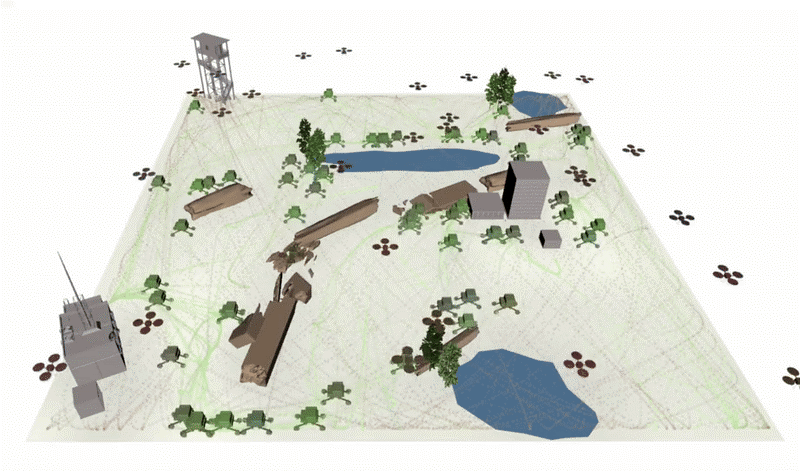

## About Me

I am a Ph. D. Candidate at Northwestern University advised by Todd Murphey in the [Interactive and Emergent Autonomy Lab](https://murpheylab.github.io/).
### Background

### Research Interests
Check out my work below!

## Safe Coverage with Limited Communication
[Safe Coverage for Heterogeneous Systems with Limited Communication](https://ieeexplore.ieee.org/abstract/document/10669222)

## Robot Collaboration with Implicit Communication
[Image to Patterning: Density-specified Patterning of Micro-structured Surfaces with a Mobile Robot](https://ieeexplore.ieee.org/document/10802317 'Link title')

